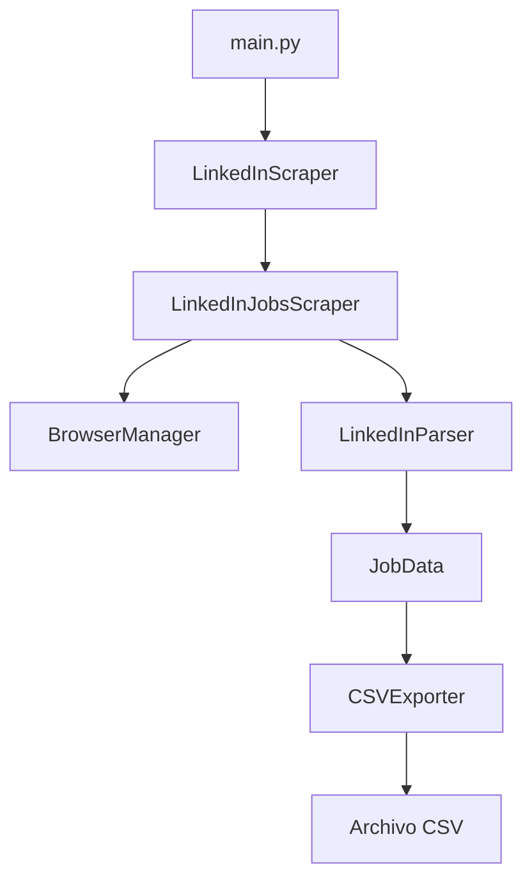

# Documentación - Scraper LinkedIn Jobs Argentina

## 📋 Índice
- [Descripción General](#descripción-general)
- [Arquitectura del Sistema](#arquitectura-del-sistema)
- [Estructura de Archivos](#estructura-de-archivos)
- [Componentes Principales](#componentes-principales)
- [Guía de Uso](#guía-de-uso)
- [API Reference](#api-reference)
- [Configuración](#configuración)
- [Ejemplos](#ejemplos)
- [Problemas comunes](#troubleshooting)

## 📖 Descripción General

El **Scraper LinkedIn Jobs** es un sistema automatizado de extracción de empleos optimizado para LinkedIn Argentina. Utiliza Playwright para navegación web robusta y técnicas anti-detección para realizar scraping eficiente y confiable de ofertas laborales.

### Características Principales
- ✅ **Scraping Asíncrono**: Procesamiento paralelo para máximo rendimiento
- ✅ **Anti-Detección**: Técnicas stealth para evitar bloqueos
- ✅ **Extracción Robusta**: Parser inteligente con múltiples selectores de respaldo
- ✅ **Exportación CSV**: Datos estructurados listos para análisis
- ✅ **Logging Avanzado**: Monitoreo completo del proceso
- ✅ **Manejo de Errores**: Recuperación automática y reintentos
- ✅ **Login Automático**: Soporte para autenticación opcional

## 🏗️ Arquitectura del Sistema

```
scrapers/linkedin/
├── main.py          # Punto de entrada y orquestador principal
├── scraper.py       # Motor de scraping con Playwright
├── parser.py        # Extractor y parseador de datos HTML
└── __init__.py      # Inicialización del módulo
```

### Flujo de Datos


## 📁 Estructura de Archivos

### `/scrapers/linkedin/` - Módulo Principal
```
linkedin/
├── __init__.py      # Exportaciones del módulo
├── main.py          # CLI y orquestador principal
├── scraper.py       # Motor de scraping
└── parser.py        # Parser de datos HTML
```

## 🔧 Componentes Principales

### 1. **main.py** - Orquestador Principal
```python
# Componentes principales
class CSVExporter          # Exportador de datos a CSV
class LinkedInScraper      # Gestor de sesión de scraping
async def main()           # Función principal CLI
```

**Responsabilidades:**
- Gestión de argumentos CLI
- Coordinación de componentes
- Exportación de resultados
- Manejo de errores globales

### 2. **scraper.py** - Motor de Scraping
```python
class LinkedInJobsScraper:
    async def scrape_jobs()               # Scraping principal
    async def scrape_job_details()        # Scraping detallado
    async def _scrape_search_term()       # Scraping por término
    async def _handle_access_and_login()  # Manejo de autenticación
```

**Características:**
- Scraping asíncrono con Playwright
- Técnicas anti-detección
- Login automático opcional
- Manejo automático de reintentos
- Eliminación de duplicados

### 3. **parser.py** - Extractor de Datos
```python
@dataclass
class JobData               # Estructura de datos de empleo

class LinkedInParser:
    async def find_job_elements()      # Búsqueda de elementos
    async def parse_job_element()      # Parse de elemento individual
    async def scrape_job_details()     # Scraping de detalles
```

**Funcionalidades:**
- Selectores múltiples para robustez
- Validación de datos extraídos
- Limpieza automática de texto
- Extracción de metadatos de empleos

## 🚀 Guía de Uso

### Uso Básico
```bash
# Scraping con términos por defecto
python -m scrapers.linkedin.main

# Términos específicos
python -m scrapers.linkedin.main --terms "python developer" "data analyst"

# Limitar empleos
python -m scrapers.linkedin.main --max-jobs 20

# Modo de prueba
python -m scrapers.linkedin.main --test
```

### Parámetros CLI
```bash
# Ayuda completa
python -m scrapers.linkedin.main --help

# Ejemplos de uso
python -m scrapers.linkedin.main --terms "frontend developer" --max-jobs 30
python -m scrapers.linkedin.main --test  # Máximo 10 empleos
```

## 📚 API Reference

### JobData
Estructura de datos para empleos extraídos.

```python
@dataclass
class JobData:
    indice: int                         # Índice del empleo
    fecha_extraccion: str               # Fecha de extracción
    titulo_puesto: str                  # Título del puesto
    empresa: str                        # Nombre de la empresa
    ubicacion: str                      # Ubicación del empleo
    url_empleo: str                     # URL del empleo
    modalidad: str                      # Modalidad (Remoto/Híbrido/Presencial)
    fecha_publicacion: str              # Fecha de publicación
    descripcion_breve: str              # Descripción breve
    nivel_experiencia: str              # Nivel de experiencia requerido
    beneficios_ofrecidos: str           # Beneficios ofrecidos
```

### LinkedInJobsScraper

#### Métodos Principales

**`scrape_jobs(search_terms: List[str], max_jobs: int) -> List[JobData]`**
- Scraping principal de empleos por términos de búsqueda
- Retorna lista de empleos únicos
- Maneja múltiples términos de forma asíncrona

**`scrape_job_details(jobs: List[JobData], max_details: int) -> List[JobData]`**
- Scraping detallado de empleos específicos
- Extrae información adicional de páginas individuales
- Optimizado para lotes de empleos

#### Configuración

```python
scraper = LinkedInJobsScraper()
```

### LinkedInParser

#### Métodos de Extracción

**`find_job_elements(page: Page, max_jobs: int) -> List[ElementHandle]`**
- Encuentra elementos de empleos en la página
- Usa múltiples selectores para robustez
- Valida elementos con contenido útil

**`parse_job_element(element: ElementHandle, index: int) -> Optional[JobData]`**
- Extrae datos de un elemento empleo
- Valida calidad de datos extraídos
- Retorna None si datos insuficientes

**`scrape_job_details(page: Page, url: str) -> Dict[str, str]`**
- Extrae detalles adicionales de página individual
- Obtiene descripción completa y beneficios
- Maneja errores de navegación

### CSVExporter

**`export_to_csv(jobs: List[JobData], filename: str = None) -> Optional[str]`**
- Exporta empleos a archivo CSV
- Genera nombre automático con timestamp
- Valida empleos antes de exportar
- Retorna ruta del archivo generado

### LinkedInScraper (Clase Principal)

**`run() -> Dict[str, Any]`**
- Ejecuta scraping completo
- Coordina todos los componentes
- Retorna estadísticas de ejecución

## ⚙️ Configuración

### Variables de Configuración
```python
# En core/config.py
LINKEDIN_CONFIG = {
    'search_terms': [
        'python developer',
        'data analyst', 
        'frontend developer',
        'backend developer',
        'project manager'
    ],
    'email': 'tu_email@ejemplo.com',    # Opcional para login
    'password': 'tu_password',          # Opcional para login
    'max_jobs_per_term': 50,
    'timeout': 30000
}

SCRAPING_CONFIG = {
    'delay_range': (3, 8),
    'stealth_mode': True,
    'browser_args': ['--no-sandbox']
}
```

### Selectores CSS
Los selectores se configuran en `parser.py`:
```python
self.job_container_selectors = [
    'ul li:has(a[href*="/jobs/view/"])',
    'li[data-occludable-job-id]',
    'li:has(div div div div div div a[href*="/jobs/view/"])'
]

title_selectors = [
    'a[href*="/jobs/view/"] span strong',
    'a[href*="/jobs/view/"] strong',
    'div div div div div div a[href*="/jobs/view/"] span strong'
]
```

## 💡 Ejemplos

### Ejemplo 1: Scraping Básico
```python
import asyncio
from scrapers.linkedin import LinkedInScraper

async def main():
    scraper = LinkedInScraper(
        search_terms=["python developer", "data analyst"],
        max_jobs=30
    )
    
    results = await scraper.run()
    
    if results['success']:
        print(f"Empleos extraídos: {results['jobs_count']}")
        print(f"Archivo CSV: {results['csv_file']}")

asyncio.run(main())
```

### Ejemplo 2: Scraping con Detalles
```python
from scrapers.linkedin import scrape_linkedin_jobs

async def scrape_with_details():
    jobs = await scrape_linkedin_jobs(
        search_terms=["frontend developer"],
        max_jobs=20,
        include_details=True  # Incluir detalles completos
    )
    
    for job in jobs:
        print(f"Título: {job.titulo_puesto}")
        print(f"Empresa: {job.empresa}")
        print(f"Modalidad: {job.modalidad}")
        print(f"Descripción: {job.descripcion_breve}")
        print("-" * 50)
```

### Ejemplo 3: Análisis de Datos
```python
from scrapers.linkedin import LinkedInJobsScraper

async def analyze_jobs():
    scraper = LinkedInJobsScraper()
    jobs = await scraper.scrape_jobs(["data scientist"], 50)
    
    # Análisis de modalidades
    modalidades = {}
    for job in jobs:
        modalidad = job.modalidad
        modalidades[modalidad] = modalidades.get(modalidad, 0) + 1
    
    print("Distribución de modalidades:")
    for modalidad, count in modalidades.items():
        print(f"{modalidad}: {count}")
```

### Ejemplo 4: Exportación Personalizada
```python
from scrapers.linkedin import CSVExporter, JobData

# Crear datos de ejemplo
jobs = [
    JobData(
        indice=1,
        titulo_puesto="Python Developer",
        empresa="TechCorp",
        ubicacion="Buenos Aires, Argentina",
        modalidad="Remoto"
    )
]

# Exportar
exporter = CSVExporter(output_dir="./exports")
csv_file = exporter.export_to_csv(jobs, "empleos_custom.csv")
```

## 🔍 Troubleshooting

### Problemas Comunes

#### 1. **No se encuentran empleos**
```
❌ No se encontraron empleos
```
**Soluciones:**
- Verificar términos de búsqueda
- Comprobar conectividad
- Revisar selectores CSS actualizados
- Verificar si LinkedIn requiere login

#### 2. **Errores de timeout**
```
TimeoutError: waiting for selector
```
**Soluciones:**
- Aumentar timeout en configuración
- Verificar estabilidad de conexión
- Usar modo de prueba para debug
- Comprobar si LinkedIn está bloqueando el acceso

#### 3. **Problemas de login**
```
❌ Login falló
```
**Soluciones:**
- Verificar credenciales en configuración
- Usar login manual cuando se solicite
- Comprobar si LinkedIn requiere verificación 2FA
- Verificar que la cuenta no esté bloqueada

#### 4. **Posibles bloqueos**
```
⚠️ Posible bloqueo detectado
```
**Soluciones:**
- Reducir velocidad de scraping
- Usar diferentes user agents
- Implementar proxies rotativos
- Esperar tiempo entre sesiones

### Logs y Debugging

#### Activar Debug Logging
```python
from core.logger import LogConfig, get_logger

config = LogConfig(
    level="DEBUG",
    json_format=False
)
logger = get_logger("debug", config)
```

#### Análisis de Performance
```python
from core.logger import PerformanceLogger

perf_logger = PerformanceLogger(logger)
perf_logger.start("scraping_session")
# ... código de scraping ...
perf_logger.end(success=True, jobs_count=25)
```

### Mejores Prácticas

1. **Uso Responsable**
   - Respetar términos de servicio de LinkedIn
   - Implementar delays apropiados
   - No sobrecargar servidores
   - Usar datos solo para propósitos legítimos

2. **Manejo de Autenticación**
   - Usar credenciales propias únicamente
   - No compartir información de login
   - Considerar usar API oficial cuando esté disponible
   - Manejar verificaciones de seguridad

3. **Manejo de Errores**
   - Siempre usar try/catch
   - Implementar logging detallado
   - Manejar reconexiones
   - Validar datos extraídos

4. **Optimización**
   - Limitar empleos por sesión
   - Usar scraping selectivo
   - Cachear resultados cuando sea posible
   - Monitorear recursos del sistema

5. **Mantenimiento**
   - Monitorear cambios en selectores
   - Actualizar user agents
   - Revisar logs regularmente
   - Mantener actualizadas las dependencias

### Campos CSV Exportados

El CSV exportado contiene los siguientes campos:

| Campo | Descripción | Ejemplo |
|-------|-------------|---------|
| `indice` | Número de índice del empleo | 1, 2, 3... |
| `fecha_extraccion` | Fecha cuando se extrajo | 2025-06-06 |
| `titulo_puesto` | Título del puesto de trabajo | "Python Developer" |
| `empresa` | Nombre de la empresa | "TechCorp SA" |
| `ubicacion` | Ubicación del empleo | "Buenos Aires, Argentina" |
| `url_empleo` | URL completa del empleo | "https://www.linkedin.com/jobs/view/123456" |
| `modalidad` | Tipo de trabajo | "Remoto", "Híbrido", "Presencial" |
| `fecha_publicacion` | Cuándo se publicó | "Hace 2 días" |
| `descripcion_breve` | Descripción corta del empleo | "Desarrollador Python con experiencia..." |
| `nivel_experiencia` | Nivel requerido | "Mid-Senior level" |
| `beneficios_ofrecidos` | Beneficios mencionados | "Seguro médico, trabajo remoto" |

### Troubleshooting Avanzado

#### Error: "No se pudo acceder a LinkedIn"
```python
# Solución: Verificar configuración de red
import asyncio
from playwright.async_api import async_playwright

async def test_linkedin_access():
    async with async_playwright() as p:
        browser = await p.chromium.launch(headless=False)
        page = await browser.new_page()
        
        try:
            await page.goto("https://www.linkedin.com/jobs/")
            print("✅ Acceso exitoso a LinkedIn")
        except Exception as e:
            print(f"❌ Error de acceso: {e}")
        finally:
            await browser.close()

asyncio.run(test_linkedin_access())
```

#### Error: "Selectores no encontrados"
```python
# Solución: Verificar selectores actuales
async def debug_selectors(page):
    selectors_to_test = [
        'ul li:has(a[href*="/jobs/view/"])',
        'li[data-occludable-job-id]',
        'a[href*="/jobs/view/"]'
    ]
    
    for selector in selectors_to_test:
        try:
            elements = await page.query_selector_all(selector)
            print(f"Selector '{selector}': {len(elements)} elementos")
        except Exception as e:
            print(f"Selector '{selector}': Error - {e}")
```
