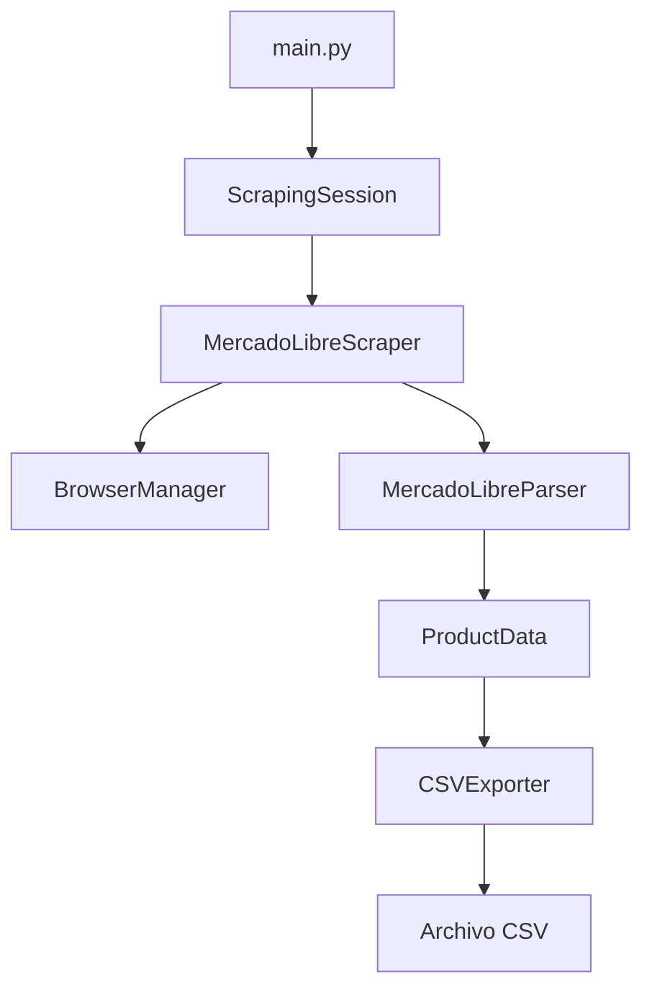

# Documentación - Scraper MercadoLibre Argentina

## 📋 Índice
- [Descripción General](#descripción-general)
- [Arquitectura del Sistema](#arquitectura-del-sistema)
- [Estructura de Archivos](#estructura-de-archivos)
- [Componentes Principales](#componentes-principales)
- [Guía de Uso](#guía-de-uso)
- [API Reference](#api-reference)
- [Configuración](#configuración)
- [Ejemplos](#ejemplos)
- [Problemas comunes](#Troubleshooting)


## 📖 Descripción General

El **Scraper MercadoLibre** es un sistema automatizado de extracción de datos optimizado para MercadoLibre Argentina. Utiliza Playwright para navegación web robusta y técnicas anti-detección para realizar scraping eficiente y confiable.

### Características Principales
- ✅ **Scraping Asíncrono**: Procesamiento paralelo para máximo rendimiento
- ✅ **Anti-Detección**: Técnicas stealth para evitar bloqueos
- ✅ **Extracción Robusta**: Parser inteligente con múltiples selectores de respaldo
- ✅ **Exportación CSV**: Datos estructurados listos para análisis
- ✅ **Logging Avanzado**: Monitoreo completo del proceso
- ✅ **Manejo de Errores**: Recuperación automática y reintentos

## 🏗️ Arquitectura del Sistema

```
scrapers/mercadolibre/
├── main.py          # Punto de entrada y orquestador principal
├── scraper.py       # Motor de scraping con Playwright
├── parser.py        # Extractor y parseador de datos HTML
└── __init__.py      # Inicialización del módulo
```

### Flujo de Datos


## 📁 Estructura de Archivos

### `/scrapers/mercadolibre/` - Módulo Principal
```
mercadolibre/
├── __init__.py      # Exportaciones del módulo
├── main.py          # CLI y orquestador principal
├── scraper.py       # Motor de scraping
└── parser.py        # Parser de datos HTML
```

## 🔧 Componentes Principales

### 1. **main.py** - Orquestador Principal
```python
# Componentes principales
class CSVExporter          # Exportador de datos a CSV
class ScrapingSession      # Gestor de sesión de scraping
async def main()           # Función principal CLI
```

**Responsabilidades:**
- Gestión de argumentos CLI
- Coordinación de componentes
- Exportación de resultados
- Manejo de errores globales

### 2. **scraper.py** - Motor de Scraping
```python
class MercadoLibreScraper:
    async def scrape_products()           # Scraping principal
    async def scrape_product_details()    # Scraping detallado
    async def _scrape_search_term()       # Scraping por término
    async def _extract_products_with_parser()  # Extracción con parser
```

**Características:**
- Scraping asíncrono con Playwright
- Técnicas anti-detección
- Manejo automático de reintentos
- Eliminación de duplicados

### 3. **parser.py** - Extractor de Datos
```python
@dataclass
class ProductData           # Estructura de datos de producto

class MercadoLibreParser:
    async def find_product_elements()     # Búsqueda de elementos
    async def parse_product_element()     # Parse de elemento individual
    async def scrape_product_details()    # Scraping de detalles
```

**Funcionalidades:**
- Selectores múltiples para robustez
- Validación de datos extraídos
- Limpieza automática de texto
- Extracción de metadatos

## 🚀 Guía de Uso


### Uso Básico
```bash
# Scraping con términos por defecto
python -m scrapers.mercadolibre.main

# Términos específicos
python -m scrapers.mercadolibre.main --terms "notebook" "smartphone"

# Limitar productos
python -m scrapers.mercadolibre.main --max-products 20

# Modo de prueba
python -m scrapers.mercadolibre.main --test
```

## 📚 API Reference

### ProductData
Estructura de datos para productos extraídos.

```python
@dataclass
class ProductData:
    producto: str                    # Nombre del producto
    precio: str                      # Precio formateado
    vendedor: str                    # Nombre del vendedor
    ubicacion: str                   # Ubicación del vendedor
    reputacion_vendedor: str         # Reputación del vendedor
    fecha_extraccion: str            # Fecha de extracción
    url_producto: str                # URL del producto
    disponible: str                  # Disponibilidad (Sí/No)
    envio_gratis: str                # Envío gratis (Sí/No)
    categoria: str                   # Categoría/término de búsqueda
    imagen_url: str                  # URL de imagen
    condicion: str                   # Condición del producto
```

### MercadoLibreScraper

#### Métodos Principales

**`scrape_products(search_terms: List[str]) -> List[ProductData]`**
- Scraping principal de productos por términos de búsqueda
- Retorna lista de productos únicos
- Maneja múltiples términos de forma asíncrona

**`scrape_product_details(product_urls: List[str]) -> List[Dict[str, Any]]`**
- Scraping detallado de URLs específicas
- Extrae información adicional de páginas individuales
- Optimizado para lotes de productos

#### Configuración

```python
scraper = MercadoLibreScraper()
scraper.max_products = 100  # Máximo productos por término
```

### MercadoLibreParser

#### Métodos de Extracción

**`find_product_elements(page: Page) -> List[ElementHandle]`**
- Encuentra elementos de productos en la página
- Usa múltiples selectores para robustez
- Valida elementos con contenido útil

**`parse_product_element(element: ElementHandle, search_term: str) -> Optional[ProductData]`**
- Extrae datos de un elemento producto
- Valida calidad de datos extraídos
- Retorna None si datos insuficientes

**`scrape_product_details(page: Page, url: str) -> Dict[str, str]`**
- Extrae detalles adicionales de página individual
- Obtiene ubicación y reputación del vendedor
- Maneja errores de navegación

### CSVExporter

**`export_to_csv(products: List[ProductData], filename: str = None) -> Optional[str]`**
- Exporta productos a archivo CSV
- Genera nombre automático con timestamp
- Valida productos antes de exportar
- Retorna ruta del archivo generado

## ⚙️ Configuración

### Variables de Configuración
```python
# En core/config.py
MERCADOLIBRE_CONFIG = {
    'max_products_per_term': 50,
    'search_terms': ['zapatillas', 'notebook'],
    'timeout': 30000,
    'retry_attempts': 3
}

SCRAPING_CONFIG = {
    'delay_range': (1, 3),
    'stealth_mode': True,
    'browser_args': ['--no-sandbox']
}
```

### Selectores CSS
Los selectores se configuran en `parser.py`:
```python
self.selectors = {
    'containers': [
        ".ui-search-layout__item",
        ".ui-search-results__item"
    ],
    'titles': [
        ".poly-component__title",
        ".ui-search-item__title"
    ],
    'prices': [
        ".andes-money-amount__fraction"
    ]
}
```

## 💡 Ejemplos

### Ejemplo 1: Scraping Básico
```python
import asyncio
from scrapers.mercadolibre import ScrapingSession

async def main():
    session = ScrapingSession(
        search_terms=["notebook", "smartphone"],
        max_products=30
    )
    
    results = await session.run_scraping()
    
    if results['success']:
        print(f"Productos extraídos: {results['products_scraped']}")
        print(f"Archivo CSV: {results['csv_file']}")

asyncio.run(main())
```

### Ejemplo 2: Procesamiento de Datos
```python
from scrapers.mercadolibre import MercadoLibreScraper

async def analyze_products():
    scraper = MercadoLibreScraper()
    products = await scraper.scrape_products(["heladera"])
    
    # Análisis de precios
    prices = [p.precio for p in products if p.precio != "N/A"]
    avg_price = sum(int(p.replace('$', '').replace('.', '')) 
                   for p in prices) / len(prices)
    
    print(f"Precio promedio: ${avg_price:,.0f}")
```

### Ejemplo 3: Exportación Personalizada
```python
from scrapers.mercadolibre import CSVExporter, ProductData

# Crear datos de ejemplo
products = [
    ProductData(
        producto="Notebook Dell",
        precio="$250.000",
        vendedor="TechStore",
        categoria="notebook"
    )
]

# Exportar
exporter = CSVExporter(output_dir="./exports")
csv_file = exporter.export_to_csv(products, "productos_custom.csv")
```

## 🔍 Troubleshooting

### Problemas Comunes

#### 1. **No se encuentran productos**
```
❌ No se encontraron productos
```
**Soluciones:**
- Verificar términos de búsqueda
- Comprobar conectividad
- Revisar selectores CSS actualizados

#### 2. **Errores de timeout**
```
TimeoutError: waiting for selector
```
**Soluciones:**
- Aumentar timeout en configuración
- Verificar estabilidad de conexión
- Usar modo de prueba para debug

#### 3. **Posibles bloqueos**
```
⚠️ Posible bloqueo detectado
```
**Soluciones:**
- Reducir velocidad de scraping
- Usar diferentes user agents
- Implementar proxies rotativos

### Logs y Debugging

#### Activar Debug Logging
```python
from core.logger import LogConfig, get_logger

config = LogConfig(
    level="DEBUG",
    json_format=False
)
logger = get_logger("debug", config)
```

#### Análisis de Performance
```python
from core.logger import PerformanceLogger

perf_logger = PerformanceLogger(logger)
perf_logger.start("scraping_session")
# ... código de scraping ...
perf_logger.end(success=True, products_count=50)
```

### Mejores Prácticas

1. **Uso Responsable**
   - Respetar robots.txt
   - Implementar delays apropiados
   - No sobrecargar servidores

2. **Manejo de Errores**
   - Siempre usar try/catch
   - Implementar logging detallado
   - Manejar reconexiones

3. **Optimización**
   - Limitar productos por sesión
   - Usar scraping selectivo
   - Cachear resultados cuando sea posible

4. **Mantenimiento**
   - Monitorear cambios en selectores
   - Actualizar user agents
   - Revisar logs regularmente
